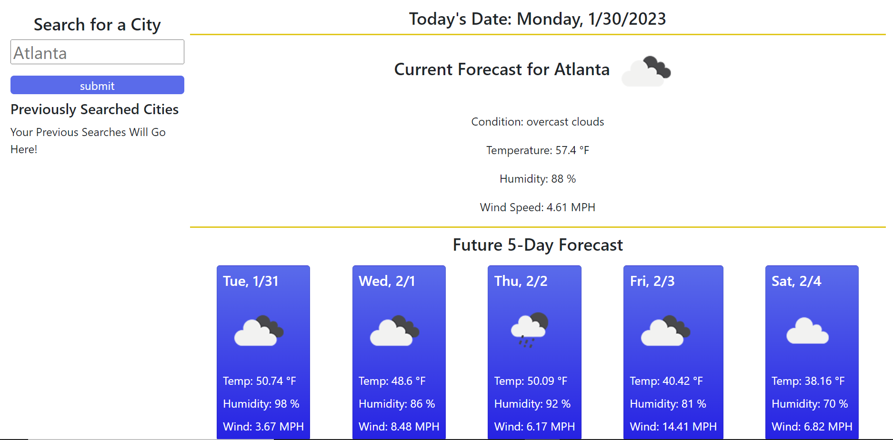
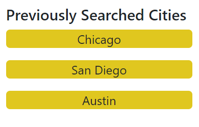
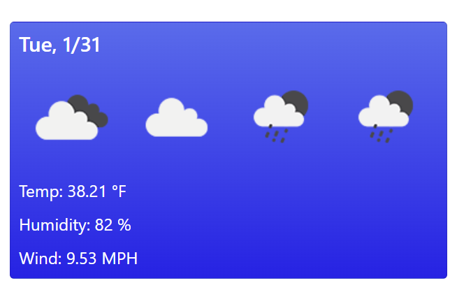

# ☀️ Weather Dashboard ☔

## Description

This application allows you to check and visualize the weather for the city of your choice. Not only will today's weather display at the top of the screen, a future five day forecase will also display below it, allowing you to plan a trip, date, or self-care day as needed!

## Installation

N/A

## Usage

The homepage shows you a default city of Atlanta and its current weather and future 5-day forecast with icons. Weather conditions included are temperature, humidity, and wind speed. 

If you would like to explore other cities, you may search for this with the search bar and hit enter or the submit button

If you have previously searched any cities, they will show up below the search bar. You may click on the previously searched cities as well instead of typing the city name again.

## Bugs

Currently, the icons in the 5-day weather forecast add together instead of replacing the previous one. The last icon in the series is the icon representation of the most recently searched city.

